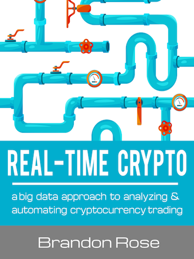

# Real-Time Crypto

This repo contains the code and materials for the [Real-Time Crypto](http:/realtimecrypto.io). The documentation and code commenting is purposefully sparse in this repository. If you are interested in learning more please check out the book [Real-Time Crypto](http:/realtimecrypto.io) which is available for Kindle, as a PDF, or a standard eBook.

Learn how to use Bitcoin data to train an algorithm to execute crypto trades in real-time. Gain insight into blockchain and big data architectures. Walk away with the know how to build a quantitative trading pipeline on your own.

### A big data approach to analyzing & automating cryptocurrency trading

Have you ever wondered how to build a cryptocurrency trading bot? Have you wondered how to apply machine learning to the financial markets? Have you ever wondered how to get out of Excel and into the world of big data?

You have come to the right place! Welcome to Real-Time Crypto. In this book we will build on your basic Python and data skills and turn you into a bona fide big data engineer. Along the way you will learn how to trade cryptocurrency in real-time, using cutting edge big data technology and machine learning.

### Is this book for you?

If you’re interested in the intersection of cryptocurrency and automation this book is for you. If you want to learn about cutting edge big data architectures this book is for you. If you’d like to learn about machine learning and time series forecasting, well, guess what? This book is for you!

Ideally, you have a basic understanding of the Python programming language so that you can follow along and build your own trading bot using the book’s code examples. If you don’t know how to write code, not to worry. This book offers a great overview of cryptocurrency, blockchain, big data technologies, and how they all fit together.
